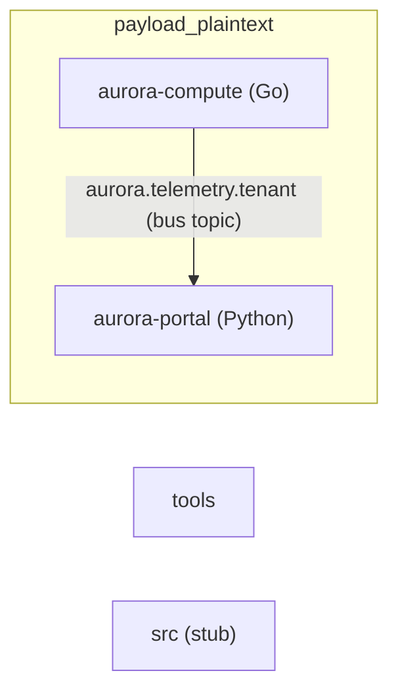

# System Architecture

> **Sources:** `docs/components/index.md`, `docs/components/tools.md`, `docs/components/payload_plaintext.md`,
> `docs/components/src.md`, `.aee/intake-summary.md`, `.aee/link-graph.json`, `.aee/link-summary.md`

---

## System Overview

The system currently comprises two operational components and one placeholder stub across 40 delivered files. The `payload_plaintext` component encompasses two Go + Python sub-services that share the `src/payload_plaintext/` directory prefix: **aurora-compute** (Go, 18 source files) is a compute-management service exposing an HTTP API, a placement scheduler, a lifecycle model, 12 uniform in-memory store services, and a telemetry publisher; **aurora-portal** (Python, 17 source files) is a pipeline-processing service with 10 uniform stage modules, 6 functional modules handling external I/O, credential management, session management, database lookup, and bus-message consumption. One confirmed cross-service bus seam connects the two sub-services: aurora-compute's `services/telemetry/publish.go` publishes YAML-encoded telemetry samples to the `aurora.telemetry.tenant` bus topic, which aurora-portal's `aurora_portal/telemetry_consumer.py` consumes — this seam carries a critical-severity taint chain (CWE-502, chain-002, severity upgraded due to the confirmed cross-component hop). The `tools` component is a Python CLI utility (`seam_index.py`) that detects cross-component join-key literals. The `src` component is an empty placeholder. Delivery is partial: 3 of the originally expected 6 components have arrived; partner components for the `aurora-cli` binary, the `aurora-network` C library, and the database driver are outstanding.

Sources: `docs/components/index.md` (Delivery Status); `docs/components/payload_plaintext.md` (Overview); `docs/components/tools.md` (Overview); `.aee/link-summary.md`.

---

## Component Inventory

| Component | Language(s) | File Count | Estimated Total Lines |
|---|---|---|---|
| `payload_plaintext` | Go (18 files), Python (17 files), UNKNOWN (3 files: `go.mod`, `.env.example`, `requirements.txt`) | 38 | ~1 518 (aurora-compute: ~1 006 L across 19 files; aurora-portal: ~512 L across 19 files) |
| `tools` | Python | 1 | ~100 (`main` at L84–100 is the last symbol) |
| `src` | UNKNOWN | 1 | 0 (empty placeholder `src/.gitkeep`) |

**aurora-compute line breakdown (from diff):** `api/profile.go` 36 L; `api/routes.go` 32 L; `api/server.go` 31 L; `go.mod` 10 L; `lifecycle/instance.go` 39 L; `scheduler/scheduler.go` 43 L; 11 uniform service stores × 65 L = 715 L; `services/telemetry/publish.go` 35 L; `services/telemetry/telemetry.go` 65 L. **aurora-portal breakdown:** 10 pipeline-stage modules × ~32 L = 320 L; `api.py` ~43 L; `maintenance.py` ~31 L; `quota.py` ~32 L; `region_lookup.py` ~14 L; `session.py` ~24 L; `telemetry_consumer.py` ~22 L; `tests/test_quota.py` ~15 L; `.env.example` ~4 L; `requirements.txt` ~7 L.

Sources: `docs/components/payload_plaintext.md` (File Inventory, Defined Symbols); `.aee/intake-summary.md` (Cumulative Totals).

---

## Cross-Component Dependency Map

At the tool-assigned component-label level (`payload_plaintext`, `tools`, `src`) no directed edges exist between distinct components: the `.aee/link-graph.json` `crossComponentSeams` entry connects the two **sub-services within** `payload_plaintext` (aurora-compute → aurora-portal via the `aurora.telemetry.tenant` bus topic). The sub-service seam is rendered below as edges between sub-service nodes inside `payload_plaintext`.

One `crossComponent: true` seam in `.aee/link-graph.json`: bus topic `aurora.telemetry.tenant`, producer `services/telemetry/publish.go:9` → consumer `aurora_portal/telemetry_consumer.py:8`. Identified via secondary literal-match pass — both sub-services share the `src/payload_plaintext/` prefix so `seam_index component_of()` cannot distinguish them. Source: `.aee/link-graph.json` (`crossComponentSeams`); `.aee/link-summary.md` (Cross-Component Seams).

---

## System-Wide Data Flow

**Entry points** (sources: `docs/components/tools.md`, `docs/components/payload_plaintext.md`, Local Data Flow):

| Entry Point | Sub-service / Component | File | Line | Description |
|---|---|---|---|---|
| `sys.argv[1]` | `tools` | `seam_index.py` | L88 | CLI source-root path; no sanitisation |
| HTTP `POST /v1/profile/apply` | aurora-compute | `api/routes.go` L13 → `api/profile.go` L23 | — | JSON body `label` field; token-gated but not sanitised before cgo call |
| HTTP `GET /v1/profile/list` | aurora-compute | `api/routes.go` L14 | — | Token-gated; response sourced from `aurora-cli profile-list` |
| HTTP `GET /v1/health` | aurora-compute | `api/routes.go` L15 | — | Health check; response from `Health()` |
| `Console(instance string)` | aurora-compute | `api/server.go` L23 | L23 | `instance` interpolated into virsh shell command; no callers in delivery |
| Bus topic `aurora.telemetry.tenant` | aurora-portal | `telemetry_consumer.py` L8–12 | — | External tenant bus messages; `message.body` deserialised with `yaml.load` |
| `region_for(cursor, project)` | aurora-portal | `region_lookup.py` | L9 | `project` interpolated into raw SQL |
| `export_report(project_id, destination)` | aurora-portal | `api.py` | L29 | Both params interpolated into shell command |
| `load_quota_profile(path)` | aurora-portal | `api.py` | L15 | Caller-supplied path opened and `yaml.load`'d |
| `fetch_project(project_id, token)` | aurora-portal | `api.py` | L20 | `project_id` interpolated into URL; `token` as Bearer |
| `apply_profile(request)` | aurora-portal | `maintenance.py` | L18 | `request["form"]["profile_name"]` as CLI argument |
| `handle(payload: dict)` (10 pipeline modules) | aurora-portal | `adapter.py` … `validator.py` | L14–18 each | External payload dict; type-check only |

**Key data paths to sinks:**

1. **aurora-compute → aurora-portal bus path (cross-service, chain-002):** `Publish()` in `publish.go` (L24–30) → `bus.Send(TenantTopic, yaml.Marshal(sample))` (L29, cross-service hop) → `consume()` + `handle()` in `telemetry_consumer.py` → `yaml.load(message.body)` (L17, unsafe-deserialization sink). Any publisher on the bus topic can send arbitrary YAML.
2. **aurora-portal command injection (chain-003):** `export_report(project_id, destination)` (api.py L29) → `"aurora-cli report --project %s > %s" % (project_id, destination)` (L30) → `os.system()` (L31).
3. **aurora-portal SQL injection (chain-004):** `region_for(cursor, project)` (region_lookup.py L9) → raw SQL `% (TABLE, project)` (L11) → `cursor.execute()` (L10).
4. **aurora-compute command injection (chain-007):** `Console(instance)` (server.go L23) → `fmt.Sprintf("virsh console %s", instance)` (L24) → `exec.Command("sh", "-c", ...)` (L24).
5. **aurora-compute cgo boundary (chain-006):** HTTP body `label` → `ApplyProfile()` (profile.go L23) → `C.CString(req.Label)` (L30) → `C.aurora_profile_label(clabel)` (L32, native call to aurora-network).

**Sinks across all components:**

| Sink | File | Line |
|---|---|---|
| `yaml.load(message.body)` — unsafe deserialization | `aurora_portal/telemetry_consumer.py` | L17 |
| `cursor.execute(sql)` — database | `aurora_portal/region_lookup.py` | L10 |
| `os.system(command)` — shell execution (aurora-portal) | `aurora_portal/api.py` | L31 |
| `yaml.load(handle.read())` — unsafe deserialization | `aurora_portal/api.py` | L17 |
| `requests.get(..., verify=False)` — network | `aurora_portal/api.py` | L21 |
| `subprocess.run(argv, ...)` — process spawn | `aurora_portal/api.py` | L43 |
| `subprocess.run(["aurora-cli", ...])` — process spawn | `aurora_portal/maintenance.py` | L19–30 |
| `bus.Send(TenantTopic, body)` — bus publish | `aurora-compute/services/telemetry/publish.go` | L29 |
| `exec.Command("sh", "-c", ...)` — shell execution (aurora-compute) | `aurora-compute/api/server.go` | L24 |
| `C.aurora_profile_label(clabel)` — cgo native call | `aurora-compute/api/profile.go` | L32 |
| `sys.stdout` (JSON / plain text) | `src/tools/seam_index.py` | L91, L93–99 |

Sources: `docs/components/tools.md`, `docs/components/payload_plaintext.md` (Side Effects, Local Data Flow).

---

## External Dependencies

Deduplicated across all components. Third-party packages and all stdlib modules imported from outside the system's own source files.

| Module | Kind | Components That Import It |
|---|---|---|
| `requests` | third-party (pip, v2.19.1) | `payload_plaintext` / aurora-portal (`api.py` L7) |
| `PyYAML` (`yaml`) | third-party (pip, v5.1) | `payload_plaintext` / aurora-portal (`api.py` L8; `telemetry_consumer.py` L6) |
| `gopkg.in/yaml.v2` | third-party (Go module) | `payload_plaintext` / aurora-compute (`services/telemetry/publish.go` L6) |
| `C` (cgo — `aurora-network/src/profile_label.h`) | native (cross-component, unresolved) | `payload_plaintext` / aurora-compute (`api/profile.go` L10) |
| `net/http` | stdlib (Go) | `payload_plaintext` / aurora-compute (`api/routes.go` L7; `api/server.go` L9; `api/profile.go` L14) |
| `crypto/tls` | stdlib (Go) | `payload_plaintext` / aurora-compute (`api/server.go` L7) |
| `os/exec` | stdlib (Go) | `payload_plaintext` / aurora-compute (`api/server.go` L10) |
| `encoding/json` | stdlib (Go) | `payload_plaintext` / aurora-compute (`api/profile.go` L13) |
| `os` (Go) | stdlib (Go) | `payload_plaintext` / aurora-compute (`api/routes.go` L8) |
| `time` | stdlib (Go) | `payload_plaintext` / aurora-compute (`lifecycle/instance.go` L6) |
| `errors` | stdlib (Go) | `payload_plaintext` / aurora-compute (`scheduler/scheduler.go` L7; all 12 service stores) |
| `sort` | stdlib (Go) | `payload_plaintext` / aurora-compute (`scheduler/scheduler.go` L8) |
| `strings` | stdlib (Go) | `payload_plaintext` / aurora-compute (all 12 service stores) |
| `unsafe` | stdlib (Go) | `payload_plaintext` / aurora-compute (`api/profile.go` L15) |
| `os` (Python) | stdlib (Python) | `payload_plaintext` / aurora-portal (`api.py` L4); `tools` (`seam_index.py` L12) |
| `subprocess` | stdlib (Python) | `payload_plaintext` / aurora-portal (`api.py` L5; `maintenance.py` L6) |
| `hashlib` | stdlib (Python) | `payload_plaintext` / aurora-portal (`session.py` L4) |
| `random` | stdlib (Python) | `payload_plaintext` / aurora-portal (`session.py` L5) |
| `string` | stdlib (Python) | `payload_plaintext` / aurora-portal (`session.py` L6) |
| `dataclasses` | stdlib (Python) | `payload_plaintext` / aurora-portal (`quota.py` L4) |
| `json` | stdlib (Python) | `tools` (`seam_index.py` L11) |
| `re` | stdlib (Python) | `tools` (`seam_index.py` L13) |
| `sys` | stdlib (Python) | `tools` (`seam_index.py` L14) |
| `collections` | stdlib (Python) | `tools` (`seam_index.py` L15) |

Source: `docs/components/payload_plaintext.md` (External Dependencies); `docs/components/tools.md` (External Dependencies); `.aee/link-graph.json` (resolved).
