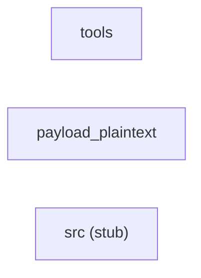

# System Architecture

> **Sources:** `docs/components/index.md`, `docs/components/tools.md`, `docs/components/payload_plaintext.md`,
> `docs/components/src.md`, `.aee/intake-summary.md`, `.aee/link-graph.json`, `.aee/link-summary.md`

---

## System Overview

The system — as delivered to date — comprises two operational components and one placeholder. The `payload_plaintext` component is the `aurora-portal` Python service: a 17-module application built around ten uniform pipeline-stage classes (Adapter, Collector, Dispatcher, Formatter, Indexer, Notifier, Publisher, Resolver, Throttle, Validator) that process external payloads, plus six functional modules handling external I/O (`api`), CLI subprocess invocations (`maintenance`), resource quota arithmetic (`quota`), database lookup (`region_lookup`), session management (`session`), and message-bus consumption (`telemetry_consumer`). The `tools` component is a self-contained Python CLI utility (`seam_index.py`) that scans a source tree for cross-component join keys (shared string literals such as bus topics, database table names, and executable names) and reports those appearing in two or more components. A third component (`src`) is represented solely by an empty placeholder (`src/.gitkeep`, language UNKNOWN) with no processable content. Delivery is partial: of the originally expected six components (targeting C, C++, Java, Go, and JavaScript in addition to Python), two fully operational components have been received; five open-end interfaces in `payload_plaintext` await their partner components (message-bus producer, database driver, `aurora-cli` binary, and the external Aurora API service). No cross-component seams are confirmed in the current delivery.

Sources: `docs/components/index.md` (Delivery Status); `docs/components/payload_plaintext.md` (Overview); `docs/components/tools.md` (Overview); `.aee/link-summary.md` (Open Ends).

---

## Component Inventory

| Component | Language(s) | File Count | Estimated Total Lines |
|---|---|---|---|
| `payload_plaintext` | Python (17 files), UNKNOWN (2 files: `.env.example`, `requirements.txt`) | 19 | ~512 (17 Python files; 10 pipeline-stage modules ~32 L each; `api.py` ~43 L; `maintenance.py` ~31 L; `quota.py` ~32 L; `region_lookup.py` ~14 L; `session.py` ~24 L; `telemetry_consumer.py` ~22 L; `tests/test_quota.py` ~15 L; `.env.example` ~4 L; `requirements.txt` ~7 L) |
| `tools` | Python | 1 | ~100 (`main` at L84–100 is the last defined function) |
| `src` | UNKNOWN | 1 | 0 (empty placeholder `src/.gitkeep`) |

Sources: `docs/components/payload_plaintext.md` (File Inventory, Defined Symbols); `docs/components/tools.md` (File Inventory, Defined Symbols); `docs/components/src.md` (File Inventory); `.aee/intake-summary.md` (Counts).

---

## Cross-Component Dependency Map

No cross-component seams exist in the current delivery. The `crossComponentSeams` array in `.aee/link-graph.json` is empty. All resolved references are either intra-component (within `payload_plaintext`: `test_quota.py` → `quota.py`) or to stdlib/external libraries. The five one-sided join keys in `payload_plaintext` are recorded as open ends in `.aee/link-graph.json` and will resolve to directed edges once their partner components arrive.

No directed edges between components — `.aee/link-graph.json` `crossComponentSeams` is empty. Open ends (awaiting partner components): bus topic `aurora.telemetry.tenant` (consumer side in `payload_plaintext`), executable `aurora-cli` (caller side, 3 call sites in `payload_plaintext`), database table `tenant_region_assignment` (reader side in `payload_plaintext`).

Source: `.aee/link-graph.json` (`crossComponentSeams`, `openEnds`); `.aee/link-summary.md` (Open Ends).

---

## System-Wide Data Flow

**Entry points** across all components (sources: `docs/components/tools.md`, `docs/components/payload_plaintext.md`, Local Data Flow sections):

| Entry Point | Component | File | Line | Description |
|---|---|---|---|---|
| `sys.argv[1]` | `tools` | `src/tools/seam_index.py` | L88 | Source-root directory path; passed without sanitisation to `os.walk()` and `open()` |
| `sys.argv` flag `--json` | `tools` | `src/tools/seam_index.py` | L90 | Selects JSON output format |
| Message bus topic `aurora.telemetry.tenant` | `payload_plaintext` | `aurora_portal/telemetry_consumer.py` | L8–12 | External tenant messages received via `bus.subscribe()`; `message.body` is untrusted |
| `region_for(cursor, project)` | `payload_plaintext` | `aurora_portal/region_lookup.py` | L9 | `project` parameter origin unknown (no callers in delivery); fed into raw SQL |
| `export_report(project_id, destination)` | `payload_plaintext` | `aurora_portal/api.py` | L29 | Both parameters origin unknown; interpolated into shell command |
| `load_quota_profile(path)` | `payload_plaintext` | `aurora_portal/api.py` | L15 | Caller-supplied file path; opened and passed to `yaml.load()` |
| `fetch_project(project_id, token)` | `payload_plaintext` | `aurora_portal/api.py` | L20 | `project_id` interpolated into URL; `token` sent as Bearer header |
| `apply_profile(request)` | `payload_plaintext` | `aurora_portal/maintenance.py` | L18 | `request["form"]["profile_name"]` used as CLI argument |
| `handle(payload: dict)` (10 pipeline modules) | `payload_plaintext` | `aurora_portal/adapter.py` … `validator.py` | L14–18 each | External payload dict; type-checked but not schema-validated |

**Data flow — `tools` component:**

1. `main()` (L84–100) reads `sys.argv[1]` as `root`; calls `scan(root)`.
2. `scan(root)` (L41–62) traverses `root` via `os.walk`, matches regex patterns from `PATTERNS` (L18–28) against file content.
3. `cross_component(hits)` (L65–81) filters to literals present in ≥ 2 components; `NOISE` exclusions (L34) applied.
4. Results written to `sys.stdout` as JSON (`json.dump`, L91) or plain text (L93–99).

Source: `docs/components/tools.md` (Local Data Flow).

**Data flow — `payload_plaintext` component (key paths):**

- Message-bus path: `consume(bus)` (telemetry_consumer.py L11–13) → `handle(message)` (L16–22) → `yaml.load(message.body)` (L17) → caller receives deserialized object.
- Database path: `region_for(cursor, project)` (region_lookup.py L9–14) → raw SQL string with `project` interpolated (L11) → `cursor.execute()` (L10) → `cursor.fetchone()` (L13) → caller receives row dict.
- CLI path: `export_report(project_id, destination)` (api.py L29–31) → shell string `"aurora-cli report --project %s > %s" % (project_id, destination)` (L30) → `os.system()` (L31).
- Quota path: `load_quota_profile(path)` (api.py L15–17) → `open(path)` (L16) → `yaml.load(...)` (L17) → caller receives deserialized quota object.
- Pipeline path: external `payload: dict` → `handle()` → `transform()` → returned to caller (no external I/O in pipeline-stage modules).

Source: `docs/components/payload_plaintext.md` (Local Data Flow).

**Sinks across all components:**

| Sink | Component | File | Line |
|---|---|---|---|
| `sys.stdout` (JSON / plain text) | `tools` | `seam_index.py` | L91, L93–99 |
| `yaml.load(message.body)` — unsafe deserialization | `payload_plaintext` | `telemetry_consumer.py` | L17 |
| `cursor.execute(sql)` — database write | `payload_plaintext` | `region_lookup.py` | L10 |
| `os.system(command)` — shell execution | `payload_plaintext` | `api.py` | L31 |
| `yaml.load(handle.read())` — unsafe deserialization | `payload_plaintext` | `api.py` | L17 |
| `requests.get(..., verify=False)` — network | `payload_plaintext` | `api.py` | L21 |
| `subprocess.run(argv, ...)` — process spawn | `payload_plaintext` | `api.py` | L43 |
| `subprocess.run(["aurora-cli", ...], ...)` — process spawn | `payload_plaintext` | `maintenance.py` | L19–23, L28–30 |

Source: `docs/components/tools.md`, `docs/components/payload_plaintext.md` (Side Effects, Local Data Flow).

---

## External Dependencies

Deduplicated across all components. "External" includes both Python stdlib and third-party (pip) packages — all are outside the system's own codebase.

| Module | Kind | Version (if pinned) | Components That Import It |
|---|---|---|---|
| `requests` | third-party (pip) | 2.19.1 | `payload_plaintext` (`api.py` L7) |
| `yaml` (PyYAML) | third-party (pip) | 5.1 | `payload_plaintext` (`api.py` L8; `telemetry_consumer.py` L6) |
| `os` | stdlib | — | `payload_plaintext` (`api.py` L4); `tools` (`seam_index.py` L12) |
| `subprocess` | stdlib | — | `payload_plaintext` (`api.py` L5; `maintenance.py` L6) |
| `hashlib` | stdlib | — | `payload_plaintext` (`session.py` L4) |
| `random` | stdlib | — | `payload_plaintext` (`session.py` L5) |
| `string` | stdlib | — | `payload_plaintext` (`session.py` L6) |
| `dataclasses` | stdlib | — | `payload_plaintext` (`quota.py` L4) |
| `json` | stdlib | — | `tools` (`seam_index.py` L11) |
| `re` | stdlib | — | `tools` (`seam_index.py` L13) |
| `sys` | stdlib | — | `tools` (`seam_index.py` L14) |
| `collections` | stdlib | — | `tools` (`seam_index.py` L15) |

Source: `docs/components/tools.md` (External Dependencies); `docs/components/payload_plaintext.md` (External Dependencies); `.aee/link-graph.json` (resolved).
