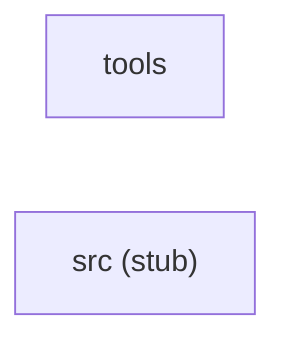

# System Architecture

> **Sources:** `docs/components/index.md`, `docs/components/tools.md`, `docs/components/src.md`,
> `.aee/intake-summary.md`, `.aee/link-graph.json`, `.aee/link-summary.md`

---

## System Overview

The system — as delivered to date — consists of a single operational component (`tools`) comprising one Python CLI file, `src/tools/seam_index.py`. This tool scans a user-supplied source tree for cross-component join keys (shared string literals such as HTTP endpoints, message-bus topics, database table names, and environment variables) and reports only those literals that appear in two or more distinct components, writing results to stdout in JSON or plain-text format. A second component (`src`) is represented solely by an empty placeholder file (`src/.gitkeep`, language UNKNOWN) and contributes no executable behaviour. Delivery is partial: only 1 of 6 expected components has arrived; files from the remaining five components (C, C++, Java, Go, JavaScript) have not yet been received. The architecture documents in this directory describe the current partial state and will be superseded by a later run when the full source set is present.

Sources: `docs/components/tools.md` (Overview); `docs/components/index.md` (Delivery Status); `.aee/intake-summary.md` (Counts).

---

## Component Inventory

| Component | Language(s) | File Count | Estimated Total Lines |
|---|---|---|---|
| `tools` | Python | 1 | ~100 (`main` at L84–100; `cross_component` at L65–81 is last substantive block) |
| `src` | UNKNOWN | 1 | 0 (empty placeholder `src/.gitkeep`) |

Sources: `docs/components/tools.md` (File Inventory, Defined Symbols); `docs/components/src.md` (File Inventory); `.aee/intake-summary.md` (Counts).

---

## Cross-Component Dependency Map

No cross-component seams exist in the current delivery. The Link Graph (`.aee/link-graph.json`, field `crossComponentSeams`) is empty; all five resolved references in `src/tools/seam_index.py` target Python stdlib and are intra-component.

No directed edges between components — `crossComponentSeams` is empty (`.aee/link-graph.json`). The diagram will gain edges in a future run when the remaining five components are delivered.

---

## System-Wide Data Flow

**Entry points** (source: `docs/components/tools.md`, Local Data Flow):

| Entry Point | Description | Line |
|---|---|---|
| `sys.argv[1]` | Source-root directory path supplied by the CLI caller; passed without sanitisation to `os.walk()` and `open()` | L88 |
| `sys.argv` (flag) | Presence of `'--json'` selects JSON output format over plain text | L90 |

**Flow:**

1. `main()` (L84–100) reads `sys.argv[1]` as `root` and calls `scan(root)`.
2. `scan(root)` (L41–62) walks `root` via `os.walk`, filters files by extension against `EXTENSIONS` (L30–32), and applies compiled regexes from `PATTERNS` (L18–28) to each file's content. Matched string literals accumulate in a `defaultdict` keyed by literal value with per-component hit lists.
3. `component_of(rel)` (L37–38) derives a component label from each relative file path.
4. `cross_component(hits)` (L65–81) filters the accumulator to literals appearing in two or more distinct components; `NOISE` exclusions (L34) are applied.
5. `main()` routes the filtered list to the appropriate stdout sink.

**Sinks** (source: `docs/components/tools.md`, Local Data Flow):

| Sink | Description | Line |
|---|---|---|
| `sys.stdout` (JSON) | `json.dump` of the seams list | L91 |
| `sys.stdout` (plain text) | Formatted seam report | L93–99 |

The `src` component (stub) has no entry points, data flow, or sinks. Source: `docs/components/src.md`.

---

## External Dependencies

All external dependencies used in the current delivery are Python standard-library modules. No third-party packages are imported.

| Module | Imported Name | Component | Line |
|---|---|---|---|
| `json` | `json` | `tools` | L11 |
| `os` | `os` | `tools` | L12 |
| `re` | `re` | `tools` | L13 |
| `sys` | `sys` | `tools` | L14 |
| `collections` | `defaultdict` | `tools` | L15 |

Source: `docs/components/tools.md` (External Dependencies); `.aee/link-graph.json` (resolved).
