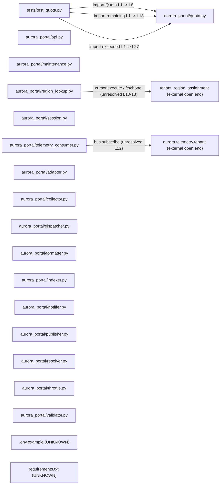

# Component: payload_plaintext

## Overview

The `payload_plaintext` component is the `aurora-portal` Python service. It contains 19 files: 16 Python source modules, one test module, and two non-source configuration files (a pip manifest and a dotenv template). The service is structured around a set of identical pipeline-stage modules (Adapter, Collector, Dispatcher, Formatter, Indexer, Notifier, Publisher, Resolver, Throttle, Validator), each exposing a uniform `handle`/`transform`/`stats` interface and a module-level `build()` factory. Alongside these are six functional modules: `api` (external I/O and credential storage), `maintenance` (CLI subprocess invocations), `quota` (dataclass-based resource quota arithmetic), `region_lookup` (database query), `session` (session-ID generation and password hashing), and `telemetry_consumer` (message-bus subscription). The component carries critical security findings in `api.py` and `region_lookup.py` and high-severity findings in `session.py` and `telemetry_consumer.py`.

---

## File Inventory

Source: `.aee/intake.jsonl` (batch `929829695f4d25ba1a7c53fd306113e417a6762e`, second batch).

| File | Language | KB status | Arrived |
|---|---|---|---|
| `src/payload_plaintext/aurora-portal/aurora_portal/adapter.py` | Python | parsed | 2026-10-03 |
| `src/payload_plaintext/aurora-portal/aurora_portal/api.py` | Python | parsed | 2026-10-03 |
| `src/payload_plaintext/aurora-portal/aurora_portal/collector.py` | Python | parsed | 2026-10-03 |
| `src/payload_plaintext/aurora-portal/aurora_portal/dispatcher.py` | Python | parsed | 2026-10-03 |
| `src/payload_plaintext/aurora-portal/aurora_portal/formatter.py` | Python | parsed | 2026-10-03 |
| `src/payload_plaintext/aurora-portal/aurora_portal/indexer.py` | Python | parsed | 2026-10-03 |
| `src/payload_plaintext/aurora-portal/aurora_portal/maintenance.py` | Python | parsed | 2026-10-03 |
| `src/payload_plaintext/aurora-portal/aurora_portal/notifier.py` | Python | parsed | 2026-10-03 |
| `src/payload_plaintext/aurora-portal/aurora_portal/publisher.py` | Python | parsed | 2026-10-03 |
| `src/payload_plaintext/aurora-portal/aurora_portal/quota.py` | Python | parsed | 2026-10-03 |
| `src/payload_plaintext/aurora-portal/aurora_portal/region_lookup.py` | Python | parsed | 2026-10-03 |
| `src/payload_plaintext/aurora-portal/aurora_portal/resolver.py` | Python | parsed | 2026-10-03 |
| `src/payload_plaintext/aurora-portal/aurora_portal/session.py` | Python | parsed | 2026-10-03 |
| `src/payload_plaintext/aurora-portal/aurora_portal/telemetry_consumer.py` | Python | parsed | 2026-10-03 |
| `src/payload_plaintext/aurora-portal/aurora_portal/throttle.py` | Python | parsed | 2026-10-03 |
| `src/payload_plaintext/aurora-portal/aurora_portal/validator.py` | Python | parsed | 2026-10-03 |
| `src/payload_plaintext/aurora-portal/tests/test_quota.py` | Python | parsed | 2026-10-03 |
| `src/payload_plaintext/aurora-portal/requirements.txt` | UNKNOWN | error: unparseable — pip manifest | 2026-10-03 |
| `src/payload_plaintext/aurora-portal/.env.example` | UNKNOWN | error: unparseable — dotenv template | 2026-10-03 |

---

## Defined Symbols

### Pipeline-stage modules

Ten modules share an identical class structure. Source: `.aee/kb/src/payload_plaintext/aurora-portal/aurora_portal/<module>.py.json` for each.

| Module file | Class | `__init__` | `handle` | `transform` | `stats` | `build` factory |
|---|---|---|---|---|---|---|
| `adapter.py` | `Adapter` L7–28 | L10–12 | L14–18 | L20–25 | L27–28 | L31–32 |
| `collector.py` | `Collector` L7–28 | L10–12 | L14–18 | L20–25 | L27–28 | L31–32 |
| `dispatcher.py` | `Dispatcher` L7–28 | L10–12 | L14–18 | L20–25 | L27–28 | L31–32 |
| `formatter.py` | `Formatter` L7–28 | L10–12 | L14–18 | L20–25 | L27–28 | L31–32 |
| `indexer.py` | `Indexer` L7–28 | L10–12 | L14–18 | L20–25 | L27–28 | L31–32 |
| `notifier.py` | `Notifier` L7–28 | L10–12 | L14–18 | L20–25 | L27–28 | L31–32 |
| `publisher.py` | `Publisher` L7–28 | L10–12 | L14–18 | L20–25 | L27–28 | L31–32 |
| `resolver.py` | `Resolver` L7–28 | L10–12 | L14–18 | L20–25 | L27–28 | L31–32 |
| `throttle.py` | `Throttle` L7–28 | L10–12 | L14–18 | L20–25 | L27–28 | L31–32 |
| `validator.py` | `Validator` L7–28 | L10–12 | L14–18 | L20–25 | L27–28 | L31–32 |

All `handle` signatures: `(self, payload: dict) -> dict`. All `transform` signatures: `(self, value: Any) -> Any`. All `stats` signatures: `(self) -> dict`. All `build` signatures: `(options=None) -> <ClassName>`.

### api.py

Source: `.aee/kb/src/payload_plaintext/aurora-portal/aurora_portal/api.py.json`.

| Name | Kind | Signature / Type | Lines |
|---|---|---|---|
| `DATABASE_PASSWORD` | module-level constant | `str` | L10 |
| `API_BASE` | module-level constant | `str` | L12 |
| `load_quota_profile` | function | `(path: str) -> Any` | L15–17 |
| `fetch_project` | function | `(project_id: str, token: str) -> Any` | L20–26 |
| `export_report` | function | `(project_id: str, destination: str) -> int` | L29–31 |
| `render_template` | function | `(template_path: str, context: dict) -> str` | L34–39 |
| `call_backend` | function | `(argv: list) -> subprocess.CompletedProcess` | L42–43 |

### maintenance.py

Source: `.aee/kb/src/payload_plaintext/aurora-portal/aurora_portal/maintenance.py.json`.

| Name | Kind | Signature / Type | Lines |
|---|---|---|---|
| `CLI_BINARY` | module-level constant | `str` | L9 |
| `apply_profile` | function | `(request: dict) -> dict` | L12–24 |
| `list_profiles` | function | `() -> list[str]` | L27–31 |

### quota.py

Source: `.aee/kb/src/payload_plaintext/aurora-portal/aurora_portal/quota.py.json`.

| Name | Kind | Signature / Type | Lines |
|---|---|---|---|
| `Quota` | class (dataclass) | — | L7–12 |
| `Quota.instances` | class field | `int` | L9 |
| `Quota.vcpus` | class field | `int` | L10 |
| `Quota.memory_mib` | class field | `int` | L11 |
| `Quota.volumes` | class field | `int` | L12 |
| `DEFAULT` | module-level constant | `Quota` | L15 |
| `remaining` | function | `(limit: Quota, used: Quota) -> Quota` | L18–24 |
| `exceeded` | function | `(limit: Quota, used: Quota) -> bool` | L27–32 |

### region_lookup.py

Source: `.aee/kb/src/payload_plaintext/aurora-portal/aurora_portal/region_lookup.py.json`.

| Name | Kind | Signature / Type | Lines |
|---|---|---|---|
| `TABLE` | module-level constant | `str` | L6 |
| `region_for` | function | `(cursor: Any, project: str) -> dict \| None` | L9–14 |

### session.py

Source: `.aee/kb/src/payload_plaintext/aurora-portal/aurora_portal/session.py.json`.

| Name | Kind | Signature / Type | Lines |
|---|---|---|---|
| `new_session_id` | function | `(length: int = 32) -> str` | L9–11 |
| `password_hash` | function | `(password: str, salt: str) -> str` | L14–15 |
| `constant_time_equal` | function | `(left: str, right: str) -> bool` | L18–24 |

### telemetry_consumer.py

Source: `.aee/kb/src/payload_plaintext/aurora-portal/aurora_portal/telemetry_consumer.py.json`.

| Name | Kind | Signature / Type | Lines |
|---|---|---|---|
| `TENANT_TOPIC` | module-level constant | `str` | L8 |
| `consume` | generator function | `(bus: Any) -> Generator` | L11–13 |
| `handle` | function | `(message: Any) -> dict` | L16–22 |

### tests/test_quota.py

Source: `.aee/kb/src/payload_plaintext/aurora-portal/tests/test_quota.py.json`.

| Name | Kind | Signature | Lines |
|---|---|---|---|
| `test_remaining` | function | `() -> None` | L4–9 |
| `test_exceeded` | function | `() -> None` | L12–15 |

---

## External Dependencies

Source: `.aee/kb/src/payload_plaintext/aurora-portal/aurora_portal/*.py.json` (`externalDependencies`) and `.aee/link-graph.json` (`resolved`).

| Module | Kind | Imported by (file) | Line |
|---|---|---|---|
| `os` | stdlib | `api.py` | L4 |
| `subprocess` | stdlib | `api.py` | L5 |
| `subprocess` | stdlib | `maintenance.py` | L6 |
| `hashlib` | stdlib | `session.py` | L4 |
| `random` | stdlib | `session.py` | L5 |
| `string` | stdlib | `session.py` | L6 |
| `dataclasses.dataclass` | stdlib | `quota.py` | L4 |
| `requests` | third-party (pip) | `api.py` | L7 |
| `yaml` (PyYAML) | third-party (pip) | `api.py` | L8 |
| `yaml` (PyYAML) | third-party (pip) | `telemetry_consumer.py` | L6 |
| `aurora_portal.quota` (Quota, remaining, exceeded) | intra-component | `tests/test_quota.py` | L1 |

The 10 pipeline-stage modules (adapter, collector, dispatcher, formatter, indexer, notifier, publisher, resolver, throttle, validator) declare no external dependencies — all referenced names are builtins.

---

## Side Effects

Source: `.aee/kb/src/payload_plaintext/aurora-portal/aurora_portal/*.py.json` (`sideEffects`).

| Kind | Target | File | Lines |
|---|---|---|---|
| File-system read | Caller-supplied YAML quota profile path | `api.py` | L16–17 |
| Network call | `https://api.aurora.example.com/v1/projects/<project_id>` via `requests.get` | `api.py` | L21–25 |
| Process spawn | `aurora-cli` shell command via `os.system` (shell string with interpolated args) | `api.py` | L30–31 |
| File-system read | Caller-supplied template path | `api.py` | L35–36 |
| Process spawn | Caller-supplied `argv` via `subprocess.run` | `api.py` | L43 |
| Process spawn | `aurora-cli profile-apply --name <profile_name>` via `subprocess.run` (list, no shell) | `maintenance.py` | L19–23 |
| Process spawn | `aurora-cli profile-list` via `subprocess.run` (list, no shell) | `maintenance.py` | L28–30 |
| External I/O — message bus subscription | Topic `aurora.telemetry.tenant` via caller-supplied `bus` object | `telemetry_consumer.py` | L12 |
| Database query | Table `tenant_region_assignment` via caller-supplied `cursor` | `region_lookup.py` | L10–12 |

---

## Component Diagram

Nodes represent files in this component. Solid edges are intra-component resolved symbol imports (Link Graph `resolved`, `crossComponent: false`). Dashed edges are unresolved open ends (Link Graph `unresolved`). Source: `.aee/link-graph.json`.

No cross-component seam edges exist in the Link Graph (`crossComponentSeams` is empty).

---

## Local Data Flow

Source: `.aee/kb/src/payload_plaintext/aurora-portal/aurora_portal/*.py.json` (`securitySurface`, `sideEffects`) and `.aee/security/src/payload_plaintext/aurora-portal/aurora_portal/*.findings.json`.

### Entry points

| Entry point | File | Lines | Untrusted? |
|---|---|---|---|
| `load_quota_profile(path)` — caller-supplied file path | `api.py` | L15 | depends on caller |
| `fetch_project(project_id, token)` — project_id interpolated into URL; token sent as Bearer | `api.py` | L20–26 | depends on caller |
| `export_report(project_id, destination)` — both params interpolated into shell command | `api.py` | L29–31 | depends on caller |
| `call_backend(argv)` — argv passed to `subprocess.run` | `api.py` | L42–43 | depends on caller |
| `apply_profile(request)` — `request["form"]["profile_name"]` used as CLI argument | `maintenance.py` | L18–23 | form input (user-supplied) |
| `handle(payload)` (all 10 pipeline-stage modules) — external payload dict | `adapter.py` … `validator.py` | L14–18 each | external |
| `region_for(cursor, project)` — `project` interpolated into SQL | `region_lookup.py` | L9 | depends on caller |
| `consume(bus)` → `handle(message)` — `message.body` from bus topic | `telemetry_consumer.py` | L11–22 | external (bus topic) |
| `password_hash(password, salt)` — both caller-supplied | `session.py` | L14–15 | depends on caller |

### Data paths to sinks

**Path 1 — command injection (`api.py`)**

`export_report(project_id, destination)` (L29) → string interpolation `"aurora-cli export %s %s" % (project_id, destination)` (L30) → `os.system()` (L31, process-spawn sink). Neither `project_id` nor `destination` is sanitised; shell metacharacters in either parameter achieve arbitrary command execution. Security finding: CWE-78, critical — source `.aee/security/src/payload_plaintext/aurora-portal/aurora_portal/api.py.findings.json`.

**Path 2 — SQL injection (`region_lookup.py`)**

`region_for(cursor, project)` (L9) → raw SQL string with `% (TABLE, project)` (L11) → `cursor.execute()` (L10, database-query sink). `project` is not parameterised; SQL metacharacters in `project` allow query manipulation. Security finding: CWE-89, critical — source `.aee/security/src/payload_plaintext/aurora-portal/aurora_portal/region_lookup.py.findings.json`.

**Path 3 — insecure deserialization from bus (`telemetry_consumer.py`)**

`consume(bus)` (L11–13) yields messages from bus topic `aurora.telemetry.tenant` → `handle(message)` (L16–22) → `yaml.load(message.body)` (L17, deserialization sink) with no Loader argument. Bus messages are external input; any publisher to the topic can craft a YAML payload that executes arbitrary Python. Security finding: CWE-502, high — source `.aee/security/src/payload_plaintext/aurora-portal/aurora_portal/telemetry_consumer.py.findings.json`.

**Path 4 — insecure deserialization from file (`api.py`)**

`load_quota_profile(path)` (L15) → `open(path)` (L16) → `yaml.load(handle.read())` (L17, deserialization sink) with no Loader argument. If `path` is attacker-controlled, code execution is possible. Security finding: CWE-502, high — source `.aee/security/src/payload_plaintext/aurora-portal/aurora_portal/api.py.findings.json`.

**Path 5 — outbound request with disabled TLS (`api.py`)**

`fetch_project(project_id, token)` (L20) → `requests.get(url, headers={"Authorization": "Bearer " + token}, verify=False)` (L21–25, network sink). TLS verification is disabled; the Bearer token is exposed to network-level attackers. Security finding: CWE-295, high — source `.aee/security/src/payload_plaintext/aurora-portal/aurora_portal/api.py.findings.json`.

**Path 6 — weak session ID generation (`session.py`)**

`new_session_id(length)` (L9) → `random.choice(string.ascii_letters + string.digits)` called `length` times (L11, return value). `random` is not cryptographically secure; session IDs should use `secrets`. Security finding: CWE-338, high — source `.aee/security/src/payload_plaintext/aurora-portal/aurora_portal/session.py.findings.json`.

**Path 7 — inadequate password hashing (`session.py`)**

`password_hash(password, salt)` (L14) → `hashlib.sha1((salt + password).encode()).hexdigest()` (L15, return value). SHA-1 is a fast hash unsuitable for password storage; offline brute-force is trivial. Security finding: CWE-916, high — source `.aee/security/src/payload_plaintext/aurora-portal/aurora_portal/session.py.findings.json`.

### Hardcoded credential

`DATABASE_PASSWORD = "Aur0ra-Portal-Prod-2026!"` (L10 in `api.py`). Plaintext credential committed to source. Security finding: CWE-798, critical — source `.aee/security/src/payload_plaintext/aurora-portal/aurora_portal/api.py.findings.json`.

### Pipeline-stage modules

All ten pipeline-stage modules receive an external `payload: dict` via `handle()` (L14–18 in each). The only validation performed is a type check (`isinstance(payload, dict)`, which raises `TypeError` if not a dict). No schema validation, field restriction, or sanitisation is applied before passing the payload to `transform()`. These modules produce no direct sinks themselves (no I/O side effects); their output is returned to the caller.

### test_quota.py

Imports `Quota`, `remaining`, and `exceeded` from `aurora_portal.quota` (L1); the resolved link targets L8, L18, and L27 respectively in `quota.py` (Link Graph). No entry points with external data; no security findings.

---

## Cross-Component Interfaces

The Link Graph (`crossComponentSeams`) is empty for this component. The following open ends from the Link Graph (`unresolved`) and side effects describe the service boundary; they will resolve to cross-component seams when partner components arrive.

| Open-end kind | Symbol / Target | File | Lines | Notes |
|---|---|---|---|---|
| Message-bus consumer | `bus.subscribe("aurora.telemetry.tenant")` — consumer side | `telemetry_consumer.py` | L12 | Bus client implementation not present in delivery; `bus` is an opaque parameter |
| Database reader | `cursor.execute` / `cursor.fetchone` on table `tenant_region_assignment` | `region_lookup.py` | L10–13 | Database driver not present; `cursor` is an opaque parameter |
| HTTP API consumer | `requests.get("https://api.aurora.example.com/v1/projects/...")` | `api.py` | L21–25 | External API; no partner component in delivery |
| Executable caller | `os.system("aurora-cli export ...")` | `api.py` | L30–31 | `aurora-cli` binary not in delivery |
| Executable caller (profile-apply) | `subprocess.run(["aurora-cli", "profile-apply", "--name", ...])` | `maintenance.py` | L19–23 | `aurora-cli` binary not in delivery |
| Executable caller (profile-list) | `subprocess.run(["aurora-cli", "profile-list"])` | `maintenance.py` | L28–30 | `aurora-cli` binary not in delivery |
| Subprocess caller | `subprocess.run(argv)` — caller-supplied `argv` | `api.py` | L43 | Caller and target binary unknown |
