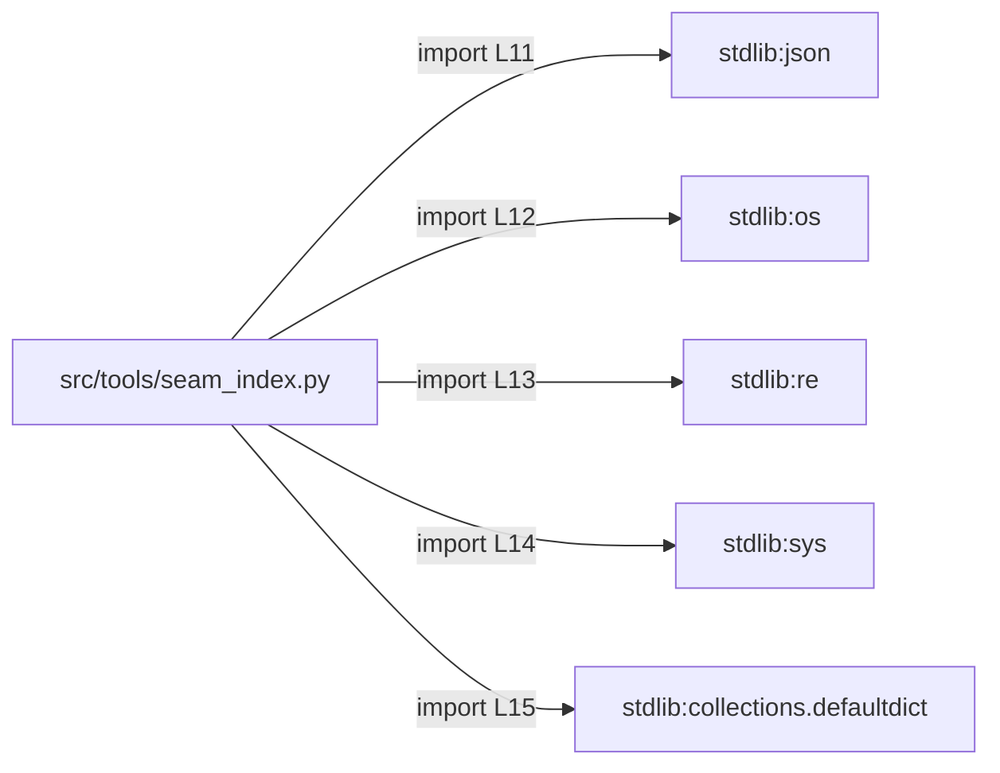

# Component: tools

## Overview

The `tools` component currently contains one file: `src/tools/seam_index.py`. It is a self-contained Python CLI tool that scans a source tree for cross-component join keys (shared literals such as HTTP endpoints, bus topics, database table names, and environment variables) and reports only those that appear in two or more distinct components. No external model or service is invoked; output is deterministic. At the time of synthesis, no cross-component seams were detected because only this component has been delivered; files from the remaining five expected components have not yet arrived.

---

## File Inventory

| File | Language | Hash (SHA-256 prefix) | Arrived |
|---|---|---|---|
| `src/tools/seam_index.py` | Python | `b8ef7a55` | 2026-10-02T18:35:27Z |

Source: `.aee/intake.jsonl` (batch `929829695f4d25ba1a7c53fd306113e417a6762e`)

---

## Defined Symbols

All symbols are defined in `src/tools/seam_index.py`. Source: `.aee/kb/src/tools/seam_index.py.json`.

| Name | Kind | Signature / Type | Lines |
|---|---|---|---|
| `PATTERNS` | module-level constant | `list[tuple[str, re.Pattern]]` | L18–28 |
| `EXTENSIONS` | module-level constant | `dict[str, str]` | L30–32 |
| `NOISE` | module-level constant | `set[str]` | L34 |
| `component_of` | function | `(rel: str) -> str` | L37–38 |
| `scan` | function | `(root: str) -> defaultdict` | L41–62 |
| `cross_component` | function | `(hits: dict) -> list` | L65–81 |
| `main` | function | `() -> int` | L84–100 |

---

## External Dependencies

All dependencies are Python stdlib. Source: `.aee/kb/src/tools/seam_index.py.json` (`externalDependencies`).

| Module | Imported name | Line |
|---|---|---|
| `json` | `json` | L11 |
| `os` | `os` | L12 |
| `re` | `re` | L13 |
| `sys` | `sys` | L14 |
| `collections` | `defaultdict` | L15 |

---

## Side Effects

Source: `.aee/kb/src/tools/seam_index.py.json` (`sideEffects`).

| Kind | Target | Lines |
|---|---|---|
| Directory traversal | `<root>` argument tree via `os.walk`; skips `.git`, `node_modules`, `build`, `target` | L43–61 |
| File-system read | Every file under `<root>` whose extension is in `EXTENSIONS`; reads full content | L52 |
| stdout write | JSON array of seams via `json.dump` (when `--json` flag present) | L91 |
| stdout write | Plain-text seam report (default mode) | L93–99 |

---

## Component Diagram

All edges are intra-component resolved imports to Python stdlib. No cross-component seam edges exist in the Link Graph (`.aee/link-graph.json`). Source: `.aee/link-graph.json` (`resolved`, `crossComponentSeams`).

---

## Local Data Flow

Source: `.aee/kb/src/tools/seam_index.py.json` (`securitySurface`, `sideEffects`) and `.aee/link-graph.json`.

**Entry points**

| Entry point | Description | Line |
|---|---|---|
| `sys.argv[1]` | Source root directory path supplied by the CLI caller; passed without sanitisation to `os.walk()` and `open()` | L88 |
| `sys.argv` (flag) | Presence of `'--json'` in `sys.argv` selects JSON output format | L90 |

**Data path — directory and file scan**

1. `main()` (L84–100) reads `sys.argv[1]` as `root` and calls `scan(root)`.
2. `scan(root)` (L41–62) walks `root` via `os.walk`, filters files by extension against `EXTENSIONS` (L30–32), opens each matching file with `open(path, encoding='utf-8', errors='ignore')` (L52), and applies each compiled regex in `PATTERNS` (L18–28) to the file contents.
3. Matched string literals are accumulated in a `defaultdict` keyed by literal value, with per-component hit lists.
4. `component_of(rel)` (L37–38) derives a component label from a relative file path.
5. `cross_component(hits)` (L65–81) filters the accumulator to retain only literals appearing in two or more components. String literals from the `NOISE` set (L34) are excluded.
6. `main()` routes the filtered list to the appropriate stdout sink (L91 or L93–99).

**Sinks**

| Sink | Description | Line |
|---|---|---|
| `sys.stdout` (JSON) | `json.dump` of the seams list; contains string literals extracted from scanned files | L91 |
| `sys.stdout` (plain text) | Formatted report of the same seams list | L93–99 |

**Untrusted data handling**

The CLI path argument (`sys.argv[1]`) enters `os.walk()` and `open()` without validation (L88, L52). Extracted string literals from scanned files are written verbatim to stdout with no filtering beyond the `NOISE` exclusion set. No sanitisation of file content occurs before output.

---

## Cross-Component Interfaces

No cross-component seams were detected. The Link Graph (`.aee/link-graph.json`, `crossComponentSeams`) is empty. Delivery is partial: only the `tools` component has arrived; the remaining five expected components (C, C++, Java, Go, JavaScript) have not yet been delivered. This section will be populated in a future run when the full source set is present. Source: `.aee/link-summary.md`.
